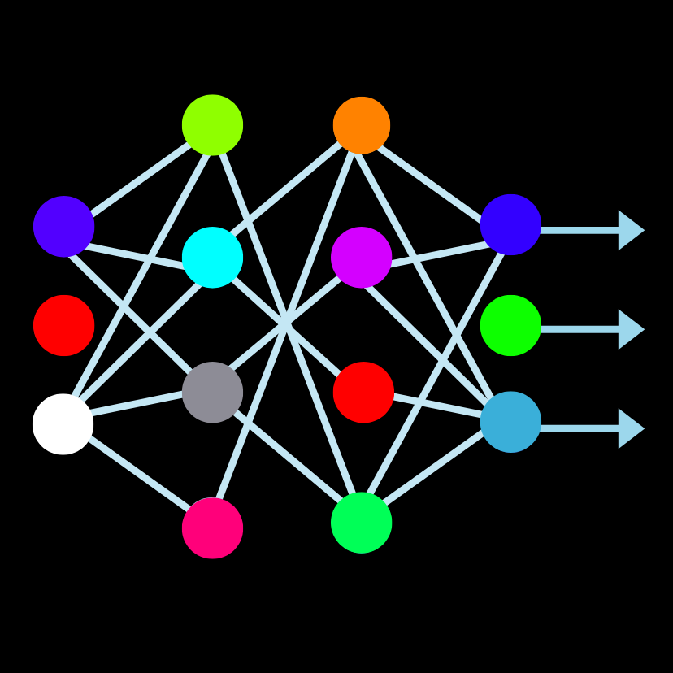
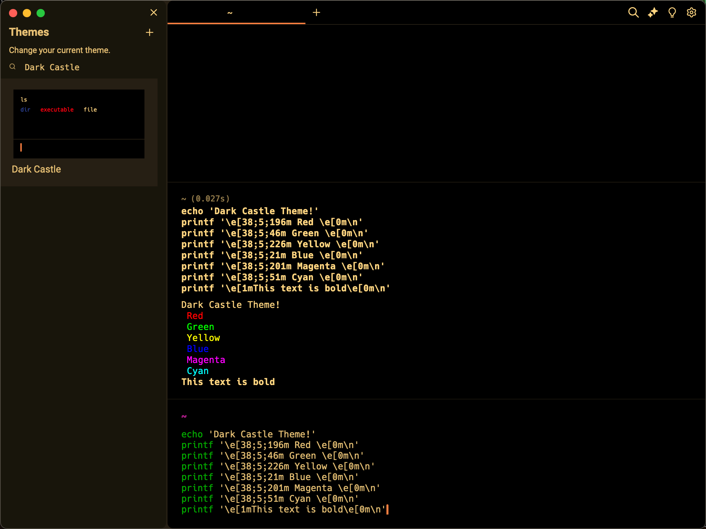

    

<h1 align="center">Dark Cyber for     
    <a href="https://www.warp.dev/" target="_blank">
    Warp
    </a>
</h1>

  A vibrantly elegant dark theme available for multiple platforms. Inspired by the cyberpunk culture and mystery of aliens, this theme combines rich, deep colors with a clean and modern design.

## Install

All instructions can be found in the included [Install](INSTALL.md) file.

## Team

This theme is maintained by the following person(s).

|  |
| ---------------------------------------------------------------------------------------- |
| [Jony Peixoto](https://github.com/jonypeixoto)                                               |                                           |

## Contributing

If you'd like to contribute to this theme, please read the [Contributing Guidelines](https://github.com/jonypeixoto/Dark-Cyber-Theme/blob/main/.github/CONTRIBUTING.md).

## Changelog

Please refer to the [Changelog](.github/CHANGELOG.md) file in this repository for updates, changes, and more detailed information about the project.

## Additional Information

- [Main GitHub Repository](https://github.com/jonypeixoto/Dark-Cyber-Theme)
- [Visit our Website](https://darkcyber.netlify.app/)

## License

[MIT License](./LICENSE)
